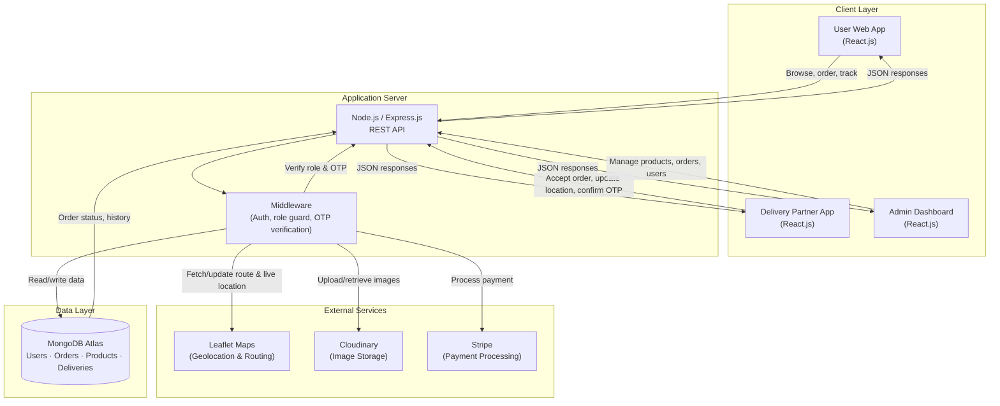
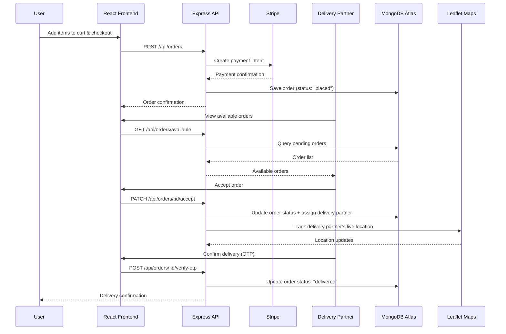

# GharBasket 🛒

**Full-Stack Online Grocery E-Commerce Platform**

GharBasket is a full-stack grocery delivery application with three role-based interfaces — **Users**, **Delivery Partners**, and **Admins** — supporting real-time order tracking, OTP verification, secure payments, and location-based delivery.

[Live Demo]((https://garhbasket-online-grocery-website.vercel.app/)) 

---


## 🧭 Overview

GharBasket connects grocery shoppers with delivery partners through a single platform. Users browse and order groceries, delivery partners fulfill and track deliveries in real time using live location data, and admins manage inventory, orders, and users — all from dedicated, role-specific dashboards.

The platform combines:
- A **React.js** frontend with **Tailwind CSS** for a responsive shopping experience
- A **Node.js/Express.js** REST API backend
- **MongoDB Atlas** for persistent orders, users, and product data
- **Leaflet Maps** for live location tracking and delivery routing
- **Cloudinary** for scalable product/profile image storage
- **Stripe** for secure payment processing

---

## ✨ Features

- 👥 **Three Role-Based Interfaces** — separate, tailored dashboards for Users, Delivery Partners, and Admins
- 🛍 **Product Browsing & Cart** — search, filter, and order groceries
- 📍 **Live Location Tracking** — Leaflet Maps integration for real-time delivery tracking
- 🔐 **OTP Verification** — secure order confirmation and delivery handoff
- 💳 **Stripe Payments** — integrated checkout with secure payment processing
- 📦 **Order Tracking** — real-time order status updates from placement to delivery
- 🖼 **Cloudinary Image Storage** — scalable storage for product and profile images
- 🛠 **Admin Controls** — manage products, orders, users, and delivery partners
- 🔄 **RESTful API Architecture** — clean separation between frontend and backend services

---

## 🛠 Tech Stack

| Layer            | Technology                                   |
|-------------------|-----------------------------------------------|
| Frontend          | React.js, Tailwind CSS                        |
| Backend           | Node.js, Express.js                           |
| Database          | MongoDB Atlas                                 |
| Maps & Location   | Leaflet Maps                                  |
| Image Storage     | Cloudinary                                    |
| Payments          | Stripe                                        |
| Hosting (suggested)| Vercel (frontend) · Render/Railway (backend) |

---

## 🏗 System Architecture



**How it works, step by step:**
1. A **User** browses products and places an order through the React frontend; the order is created via the Express API and stored in MongoDB.
2. On checkout, **Stripe** handles secure payment processing.
3. Product and profile images are uploaded to and served from **Cloudinary**.
4. Once an order is placed, a **Delivery Partner** accepts it through their dedicated app interface; their live location is tracked and shared via **Leaflet Maps**.
5. **OTP verification** confirms secure handoff of the order at delivery.
6. **Admins** monitor and manage the entire platform — products, orders, users, and delivery partners — through a separate dashboard, all backed by the same REST API and MongoDB data layer.
7. Order status updates flow back to the User in real time (e.g., placed → confirmed → out for delivery → delivered).

---

## 🔄 Data Flow



---

## 🗄 Database Schema (MongoDB)

```text
users
 ├─ _id
 ├─ name
 ├─ email
 ├─ role            // "user" | "delivery" | "admin"
 ├─ phone
 ├─ address
 └─ createdAt

products
 ├─ _id
 ├─ name
 ├─ category
 ├─ price
 ├─ stock
 ├─ imageUrl         // Cloudinary URL
 └─ createdAt

orders
 ├─ _id
 ├─ userId (ref: users)
 ├─ items[]           // { productId, quantity, price }
 ├─ totalAmount
 ├─ status            // "placed" | "accepted" | "out_for_delivery" | "delivered" | "cancelled"
 ├─ paymentStatus      // "pending" | "paid" | "failed"
 ├─ stripePaymentId
 ├─ deliveryPartnerId (ref: users)
 ├─ otp
 ├─ deliveryLocation   // { lat, lng }
 ├─ createdAt
 └─ updatedAt
```

> Adjust field names above to match your actual Mongoose schemas.

---

## 🚀 Getting Started

### Prerequisites
- Node.js (v18+)
- npm or yarn
- MongoDB Atlas account & connection string
- Cloudinary account (API key/secret)
- Stripe account (API keys)

### Installation

```bash
# Clone the repository
git clone https://github.com/Shivamgupta-anj/GharBasket.git
cd GharBasket

# Install backend dependencies
cd server
npm install

# Install frontend dependencies
cd ../client
npm install
```

### Running Locally

```bash
# Start backend (from /server)
npm run dev

# Start frontend (from /client, in a separate terminal)
npm start
```

The frontend will typically run on `http://localhost:3000` and the backend on `http://localhost:5000` (adjust based on your config).

---

## 🔑 Environment Variables

Create a `.env` file in the `/server` directory:

```env
PORT=5000
MONGODB_URI=your_mongodb_atlas_connection_string
CLOUDINARY_CLOUD_NAME=your_cloudinary_cloud_name
CLOUDINARY_API_KEY=your_cloudinary_api_key
CLOUDINARY_API_SECRET=your_cloudinary_api_secret
STRIPE_SECRET_KEY=your_stripe_secret_key
JWT_SECRET=your_jwt_secret
```

Create a `.env` file in the `/client` directory:

```env
REACT_APP_API_BASE_URL=http://localhost:5000/api
REACT_APP_STRIPE_PUBLIC_KEY=your_stripe_public_key
```

> ⚠️ Never commit `.env` files. Add them to `.gitignore`.

---

## 📁 Project Structure

```
GharBasket/
├── client/                  # React frontend
│   ├── src/
│   │   ├── components/
│   │   ├── pages/
│   │   │   ├── user/
│   │   │   ├── delivery/
│   │   │   └── admin/
│   │   ├── context/
│   │   ├── services/         # API calls
│   │   └── App.js
│   └── package.json
│
├── server/                   # Express backend
│   ├── config/                 # DB, Cloudinary, Stripe config
│   ├── controllers/
│   ├── middleware/             # Auth, role guard, OTP verification
│   ├── models/                  # Mongoose schemas
│   ├── routes/
│   ├── services/                 # Leaflet/geolocation helpers
│   └── server.js
│
└── README.md
```

---

## 📡 API Reference

| Method | Endpoint                          | Description                                | Auth Required |
|--------|-------------------------------------|----------------------------------------------|----------------|
| POST   | `/api/auth/register`               | Register a new user/delivery partner        | No             |
| POST   | `/api/auth/login`                  | Login and receive auth token                | No             |
| GET    | `/api/products`                    | List all available products                 | No             |
| POST   | `/api/orders`                      | Place a new order                            | Yes (User)     |
| GET    | `/api/orders/available`            | Get pending orders for delivery partners     | Yes (Delivery) |
| PATCH  | `/api/orders/:id/accept`           | Accept an order for delivery                 | Yes (Delivery) |
| POST   | `/api/orders/:id/verify-otp`       | Verify OTP and mark order delivered          | Yes (Delivery) |
| GET    | `/api/orders/:id/track`            | Get live delivery location                   | Yes (User)     |
| GET    | `/api/admin/orders`                | View/manage all orders                       | Yes (Admin)    |
| POST   | `/api/admin/products`              | Add/update product listings                  | Yes (Admin)    |

> Update this table to match your actual route definitions.

---

## 🗺 Roadmap

- [ ] Add real-time order status updates via WebSockets
- [ ] Add subscription/recurring order feature
- [ ] Support multiple delivery zones with dynamic pricing
- [ ] Add ratings & reviews for delivery partners
- [ ] Push notifications for order updates

---

## 🤝 Contributing

Contributions are welcome!

1. Fork the repository
2. Create your feature branch (`git checkout -b feature/AmazingFeature`)
3. Commit your changes (`git commit -m 'Add some AmazingFeature'`)
4. Push to the branch (`git push origin feature/AmazingFeature`)
5. Open a Pull Request

---

## 📄 License

Distributed under the MIT License. See `LICENSE` for more information.

---

## 📬 Contact

**Shivam Gupta**
- Email: guptashivam9161@gmail.com
- LinkedIn: [shivam-gupta-a302712b7](https://www.linkedin.com/in/shivam-gupta-a302712b7/)
- GitHub: [@Shivamgupta-anj](https://github.com/Shivamgupta-anj)
- Portfolio: [portfolio-bay-nu-36.vercel.app](https://portfolio-bay-nu-36.vercel.app/)
